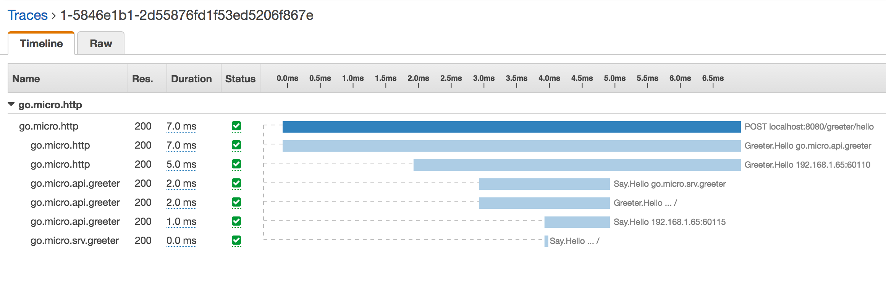

# AWS X-Ray Plugin

The AWS X-Ray plugin provides integration for the micro toolkit. 

## Usage

Register the plugin before building Micro

```
package main

import (
	"github.com/micro/micro/plugin"
	"github.com/aws/aws-sdk-go/service/xray"
	"github.com/go-micro/plugins/v2/micro/trace/awsxray"
)

func init() {
	plugin.Register(awsxray.NewXRayPlugin(
		// Used as segment name
		awsxray.WithName("go.micro.http"),
		// Specify X-Ray Daemon Address
		awsxray.WithDaemon("localhost:2000"),
		// Or X-Ray Client
		awsxray.WithClient(xray.New(awsSession)),
	))
}
```

Then just run any component like so
```
micro api
```

### Scoped to API

If you like to only apply the plugin for a specific component you can register it with that specifically. 
For example, below you'll see the plugin registered with the API.

```
package main

import (
	"github.com/micro/micro/api"
	"github.com/go-micro/plugins/v2/micro/trace/awsxray"
)

func init() {
	api.Register(awsxray.NewXRayPlugin())
}
```

## Example

<p align="center">
  
</p>
